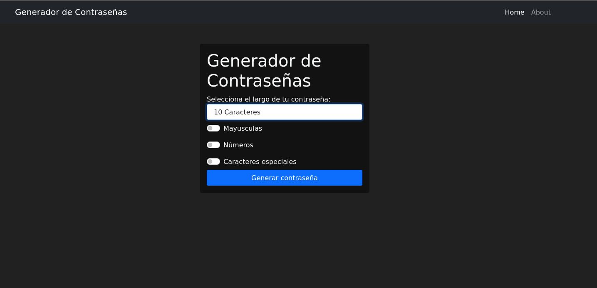
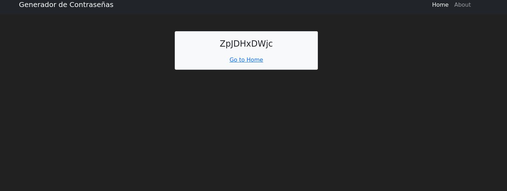
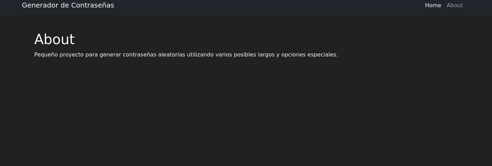

# Generador Contraseñas

## Generador de contraseñas con Django-Python






## Docker (Work in progres, not working)
```
docker build --tag python-django .
docker run --publish 8000:8000 --name python-django python-django

docker-compose up -d --> No estoy seguro que ande así nomas
```

## Instalación
```
git clone https://gitlab.com/Luzio5/p_contrasena
cd src
pip install -r requeriments.txt
python manage.py runserver
now you can visit http://localhost:8000
```

## virtualenv commands
```
source bin/activate
deactivate
```

## Django commands
```
python3 manage.py startapp nombredeapp
python3 manage.py runserver --> estando en la carpeta src de nuestro proyecto inicia el server para poder ver lo que hacemos
python3 manage.py makemigrations --> despues de hacer cambios actualizar
python3 manage.py migrate --> actualiza cosas como lo anterior o la db
python3 manage.py createsuperuser
```

## Create a Django project
```
virtualenv -p python3 .
source bin/activate
mkdir src
cd src
pip3 install Django==3.0.6 django_crontab==0.7.1 slack-webhook==1.0.3 python-kasa
django-admin startproject nombredelproyecto .
python3 manage.py migrate
cd ..
wget https://github.com/jpadilla/django-project-template/blob/master/.gitignore
python3 manage.py createsuperuser
python3 manage.py runserver
```

